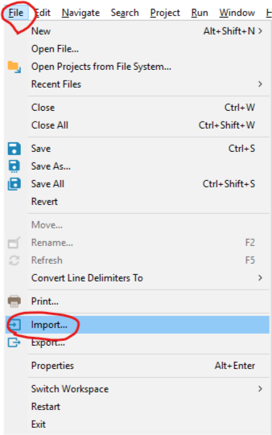
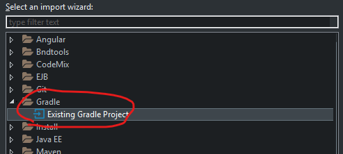
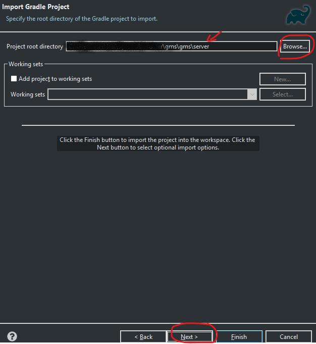
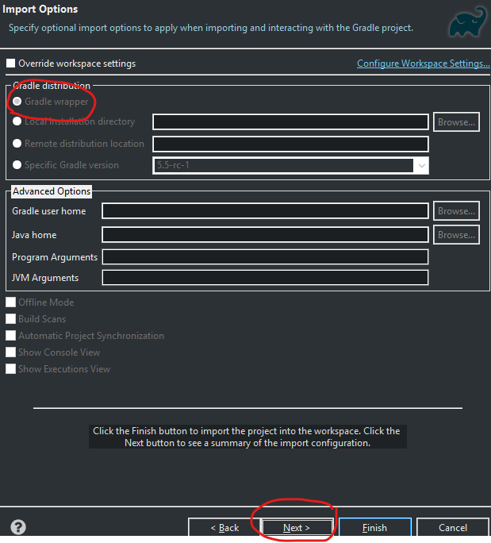
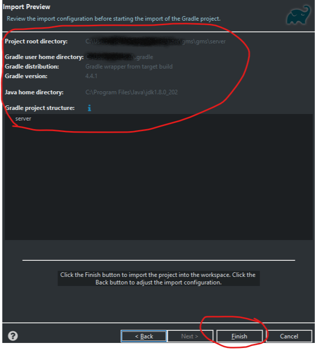
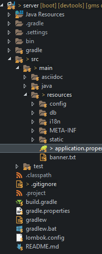
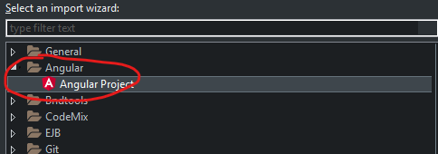
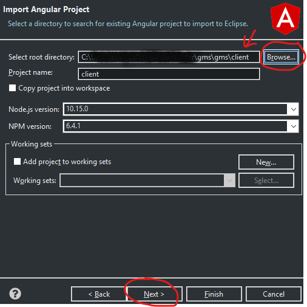
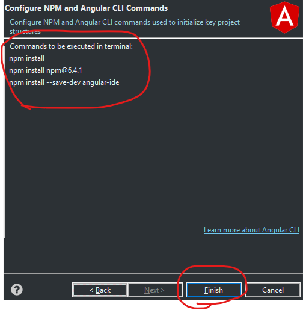
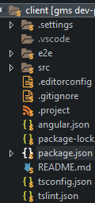

# 2. Using Eclipse

* Make a local working copy of the project (`git clone https://github.com/lealceldeiro/gms.git`).

## 2.1. API Server module

* Go to _File_ > _Import_.

* Select the wizard for "_Existing Gradle Project_"

* Select the _server_ folder location (where you ckecked out the project from github)

* Specify the [gradle][1] and Java options. The recommended way is to leave it as it is by default for gradle: use the wrapper. Nevertheless you can customize all these parameters as desired.

* Check that all parameters are the correct ones for the import in the "_Import Preview_" step and click _Finish_.

* The _server_ module should be imported at this point and shown similar to this:

## 2.2. Client module

* Go to _File_ > _Import_.

* Select the wizard for "_Angular Project_"

* Select the _client_ folder location (where you checked out the project from github)

* Check that all parameters are the correct ones for the import in the "_Configure NPM and Angular CLI Commands_" step and click _Finish_ (this will search for the [Angular CLI][2] framework) installed through the [angular-cli node package][3].

* The _client_ module should be imported at this point and shown similar to this:

### At this point in the workspace should be two projects (_server_ and _client_)

## 2.3. Additional tools

These tools are not really mandatory, but in order to get an increased productivity they are recommended.

* [Spring Tools 4 - for Spring Boot (aka Spring Tool Suite 4)][9]
* [TypeScript IDE][10]

[1]: https://gradle.org/
[2]: https://cli.angular.io/
[3]: https://www.npmjs.com/package/angular-cli
[9]: https://marketplace.eclipse.org/content/spring-tools-4-spring-boot-aka-spring-tool-suite-4
[10]: https://marketplace.eclipse.org/content/typescript-ide
