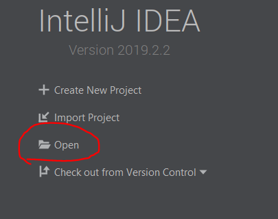
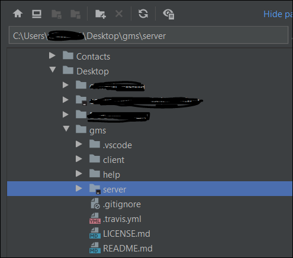
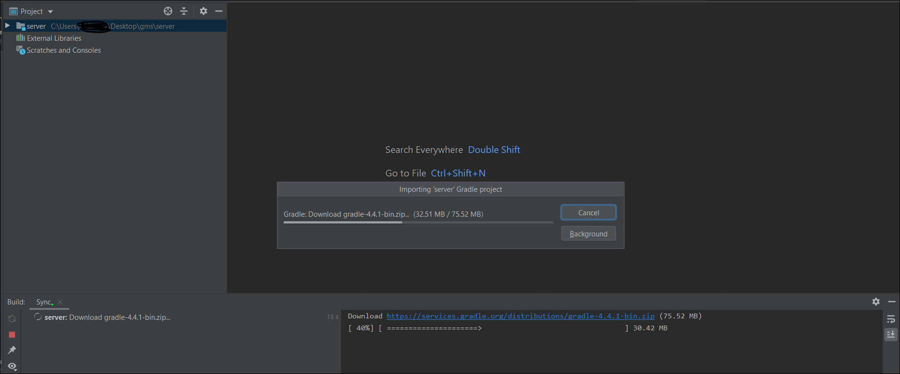
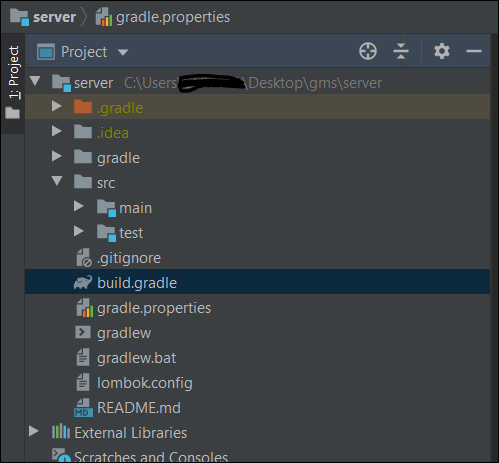
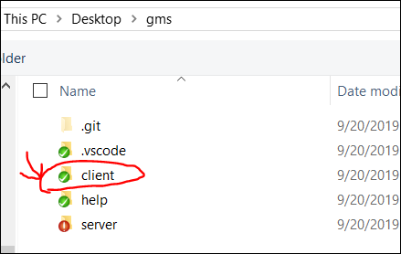

# 3. How to start developing using IntelliJ IDEA Community Edition and VSCode

* Make a local working copy of the project (`git clone https://github.com/lealceldeiro/gms.git`).

## 3.1. API Server module

* Open (import) the folder **server** in the working copy of the project.

* The IDE will start downloading the [Gradle][1] wrapper.

* This will create an IntelliJ IDEA project with one module (_server_).

## 3.2. Client module

* Go to _File_ > _Open Folder_.

* Select the folder containing the _client_ resources.

* At this point the whole project should be imported and shown similar to this:

[1]: https://gradle.org/
[2]: https://cli.angular.io/
[3]: https://www.npmjs.com/package/angular-cli
