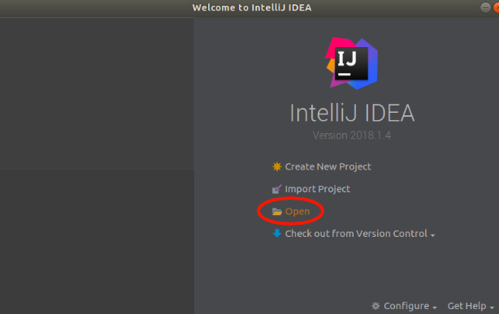
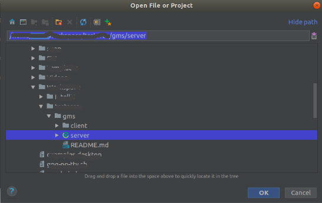
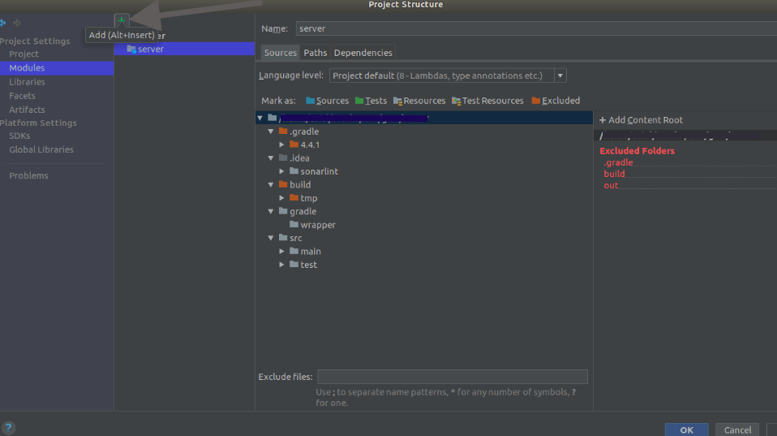
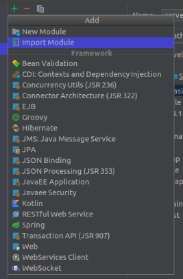
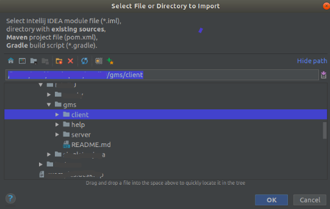
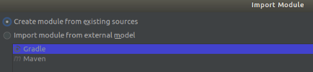
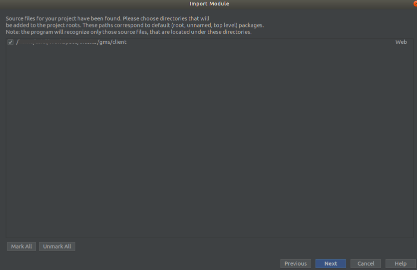
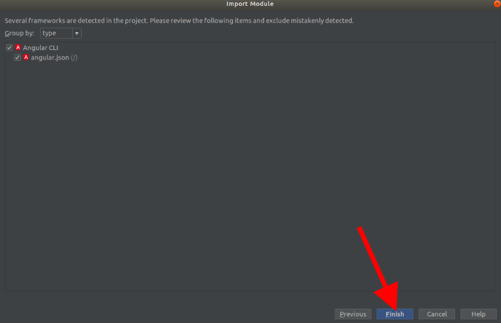
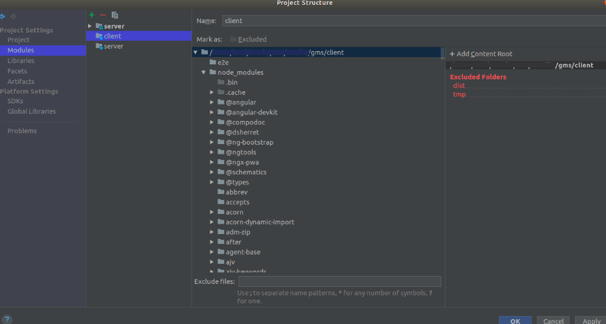

# 1. How to start developing using IntelliJ IDEA

* Make a local working copy of the project (`git clone https://github.com/lealceldeiro/gms.git`).

## 1.1. API Server module

* Open (import) the folder **server** in the working copy of the project.

* Configure the [gradle][1] options.

  1. Select the distribution of gradle to be used. The default option is "_Use default gradle wrapper_", but if you like you can check the "_Use local gradle distribution_" if you have gradle installed on your PC (in which case you must set the "Gradle home" directory.
  2. Select the JVM.
  3. Select the project format (`.idea (directory based)` in this case).

* This will create an IntelliJ IDEA project with one module (_server_). Here you should choose to add the root directory to the VCS.

## 1.2. Client module

* `Open Module Settings` (F4) and add a new module (+ green sign) and select the `Import Module` option.

* Select the folder `client` in the same level of the `server` folder.

* Select the option "_Create module from existing source_".

* _Next_.
* In the window "Import Module", keep the checkbox checked and click "Next";

* _Finish_ (this will search for the [Angular CLI][2] framework) installed through the [angular-cli node package][3].

* This will create another module on the project (_client_).

### At this point the project should contain two modules (_server_ and _client_)

[1]: https://gradle.org/
[2]: https://cli.angular.io/
[3]: https://www.npmjs.com/package/angular-cli
