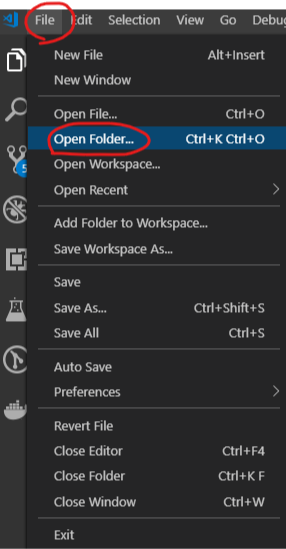
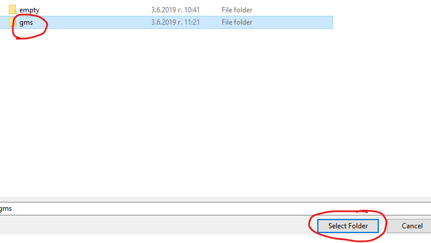
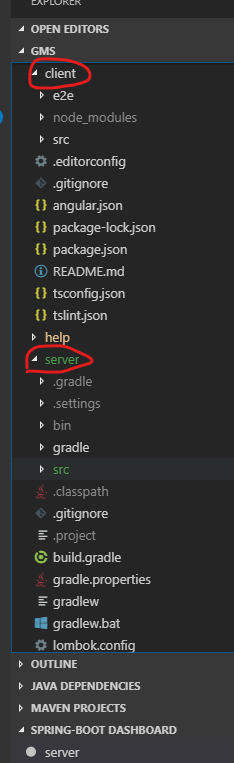

# 2. Using Visual Studio Code

* Make a local working copy of the project (`git clone https://github.com/lealceldeiro/gms.git`).

* Go to _File_ > _Open Folder_.

* Select the folder with the resources.

* At this point the whole project should be imported and shown similar to this:

## 2.1. Required extensions

These extensions are required to be added to VS Code:

* [Language Support for Java(TM) by Red Hat](https://marketplace.visualstudio.com/items?itemName=redhat.java)
* [Debugger for Java](https://marketplace.visualstudio.com/items?itemName=vscjava.vscode-java-debug)
* [Java Test Runner](https://marketplace.visualstudio.com/items?itemName=vscjava.vscode-java-test)
* [Lombok Annotations Support for VS Code](https://marketplace.visualstudio.com/items?itemName=GabrielBB.vscode-lombok)

## 2.2. Additional extensions

These extensions are not required to be installed in order to develop, but they will higly increase your productivity.

* [Java Extension Pack](https://marketplace.visualstudio.com/items?itemName=vscjava.vscode-java-pack) (this one, will actually install many of the listed below)
* [Checkstyle for Java](https://marketplace.visualstudio.com/items?itemName=shengchen.vscode-checkstyle)
* [Gradle Language Support](https://marketplace.visualstudio.com/items?itemName=naco-siren.gradle-language)
* [Java Dependency Viewer](https://marketplace.visualstudio.com/items?itemName=vscjava.vscode-java-dependency)
* [Spring Boot Extension Pack
](https://marketplace.visualstudio.com/items?itemName=Pivotal.vscode-boot-dev-pack) (this will install some of the other spring extensions listed below)
* [Spring Boot Tools](https://marketplace.visualstudio.com/items?itemName=Pivotal.vscode-spring-boot)
* [Spring Boot Dashboard](https://marketplace.visualstudio.com/items?itemName=vscjava.vscode-spring-boot-dashboard)
* [Spring Initializr Java Support](https://marketplace.visualstudio.com/items?itemName=vscjava.vscode-spring-initializr)
* [GitLens — Git supercharged](https://marketplace.visualstudio.com/items?itemName=eamodio.gitlens)
* [Debugger for Chrome](https://marketplace.visualstudio.com/items?itemName=msjsdiag.debugger-for-chrome)
* [Angular Essentials](https://marketplace.visualstudio.com/items?itemName=johnpapa.angular-essentials) (this one will actually install many of the extensions listed below for increasing productivity while developing with Angular)
* [Angular Console](https://marketplace.visualstudio.com/items?itemName=nrwl.angular-console)
* [Angular Language Service](https://marketplace.visualstudio.com/items?itemName=Angular.ng-template)
* [Angular TypeScript Snippets for VS Code](https://marketplace.visualstudio.com/items?itemName=johnpapa.Angular2)
* [angular2-inline](https://marketplace.visualstudio.com/items?itemName=natewallace.angular2-inline)
* [ESLint](https://marketplace.visualstudio.com/items?itemName=dbaeumer.vscode-eslint)
* [markdownlint](https://marketplace.visualstudio.com/items?itemName=DavidAnson.vscode-markdownlint)
* [Node npm](https://marketplace.visualstudio.com/items?itemName=eg2.vscode-npm-script)
* [Peacock](https://marketplace.visualstudio.com/items?itemName=johnpapa.vscode-peacock)
* [Code Spell Checker](https://marketplace.visualstudio.com/items?itemName=streetsidesoftware.code-spell-checker)
* [Docker](https://marketplace.visualstudio.com/items?itemName=PeterJausovec.vscode-docker) (if you are going to use [Docker](https://www.docker.com/))
* [EditorConfig for VS Code](https://marketplace.visualstudio.com/items?itemName=EditorConfig.EditorConfig)
* [IntelliJ IDEA Keybindings](https://marketplace.visualstudio.com/items?itemName=k--kato.intellij-idea-keybindings) if you come from [IntelliJ IDEA](https://www.jetbrains.com/idea/)
* [Visual Studio IntelliCode](https://marketplace.visualstudio.com/items?itemName=VisualStudioExptTeam.vscodeintellicode)
* [SQLTools](https://marketplace.visualstudio.com/items?itemName=mtxr.sqltools)

These tools are not really mandatory, but in order to get an increased productivity they are highly recommended.
